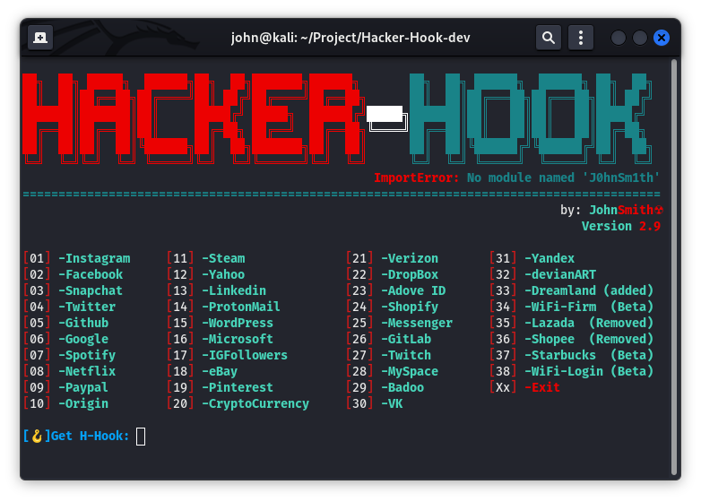
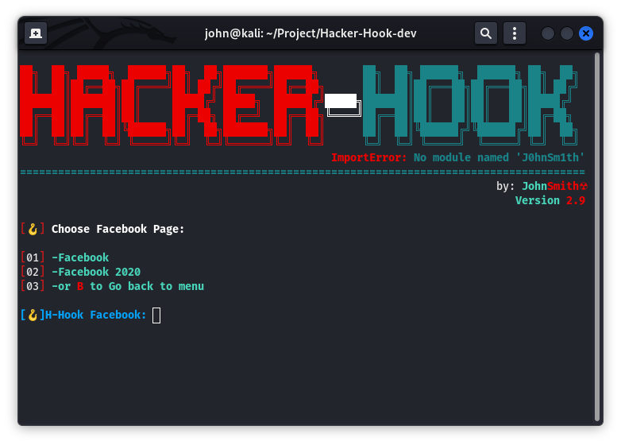
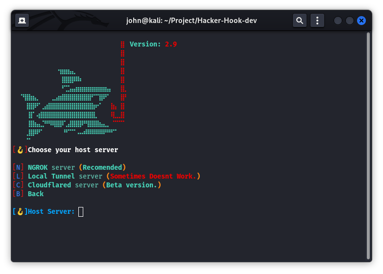
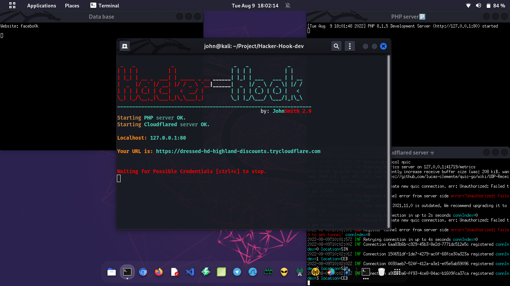

# **Hacker-Hook 2.9**

+ Hacker-Hook v2.9 is a phishing script tool created by [Johnsmith](https://github.com/johnsmith80) on github written in shell script. This script can perform advance phishing attack, giving you the option to perform phishing so easy and convenient. Its allow you to use 38 phishing pages including Facebook, Instagram, Instafollowers, Gmail, Yahoo, Amazon, Netflix, Spotify, and the new pages added Starbucks portal and WiFi-Firmware upgrade. It also capable of host tunneling by the help of ngrok, localtunnel, and cloudflare which is use for hosting. It does the job well when it comes to hosting your hook over the network. Hacker-Hook makes it easy for pentester to perform quick phishing attack when doing a pentesting.

## **DISCLAMER:**
* Developers assume NO liability and NOT responsible for any misuse or damage caused by this program. Also we inform you that some of your actions may be **ILLEGAL** and you **CAN NOT** use this tool to test to a person or company without **WRITTEN PERMISSION** from them.
+ [**ISSUE**](https://github.com/johnsmith80/Hacker-Hook/issues) and [**PULL REQUEST**](https://github.com/johnsmith80/Hacker-Hook/pulls). Feel free to give your suggestion and bugs about this tool and request for adding more sites.
+ Check other [RELEASES](https://github.com/johnsmith80/Hacker-Hook/releases)

## **HACKER-HOOK FEATURES:**
+ Advance 38 Phishing Pages
+ Ngrok, Localtunnel, Cloudflare for tunneling
+ More Advance and Secured tunneling
+ Generate a best link for you
+ Easy, Fast & Convenient Phishing attack
+ Separated stored Cred's
+ Monitor incoming Cred's
+ Added flavor for more realistic hacking
+ Added hooked fish banner
+ Added -h [help]
+ Added -v [version]
+ Added -i [Dependencies check and Install]


### TUNNELING OPTION:
+ NGROK click [here](https://ngrok.com/) download & install (required sign up for ngrok API key).
+ LocalTunnel click [here](https://www.npmjs.com/package/localtunnel) install npm.
+ Cloudflare click [here](https://developers.cloudflare.com/cloudflare-one/connections/connect-apps/run-tunnel/as-a-service/linux/) to learn more about cloudflare.
## SCREENSHOT:






## INSTALLATION & USAGE:
```
  git clone https://github.com/johnsmith80/Hacker-Hook.git
  cd Hacker-Hook
  unzip webpage.zip
  sudo ./hackerhook.sh -i
  sudo ./hackerhook.sh or sudo ./hackerhook.sh run
```
```  
  sudo ./hackerhook.sh -h # for help
  sudo ./hackerhook.sh -i # for checking dependencies and automatically install them
  sudo ./hackerhook.sh -v # check version
  sudo ./hackerhook.sh or sudo ./hackerhook.sh run # to run the program
```

## ABOUT HOST TUNNELING:
+ Make sure to sign up and register your [NGROK](https://ngrok.com/) API key before running, ngrok doesn't work without API key. [NGROK](https://ngrok.com/) can detect phishing site which then could end of disabling your API key, I suggest using a dummy email when registering for [ngrok](https://ngrok.com/) account.
+ Localtunnel might not work most of the time, If you encounter an error localtunnel didn't give you any link. It might be because of localtunnel service is down. Its happen most of the time since I use it more often than ngrok and cloudflare, The only disadvanges of localtunnel was Its give a warning portal that people should click before they get into the phish site your using.
+ Cloudflare work all the time. like ngrok, cloudflare also detect a phishing site which could give you a head bump when using cloudflare the second time. They might not detect it in the first time you run but running again with the same page might end up being blocked by cloudflare.


# **Follow me:**
+  [**Facebook**](https://web.facebook.com/h4ckitnow)
+  [**Tiktok**](https://www.tiktok.com/@d3fault80)
+  [**Twitter**](https://twitter.com/ImportJ0hnSmith)
+  [**Youtube**](https://www.youtube.com/channel/UCV5gF3dWxUOFoGA7P9NGviQ)
