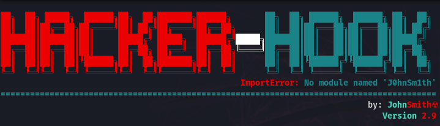
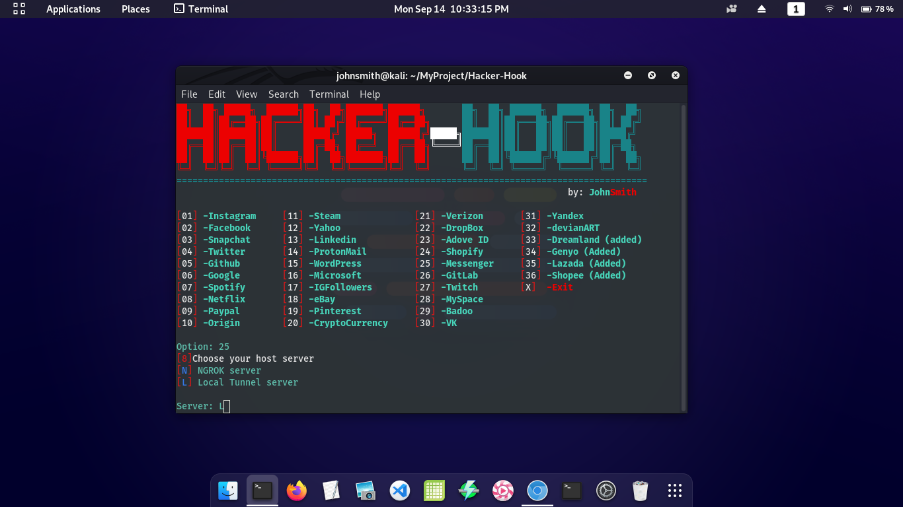
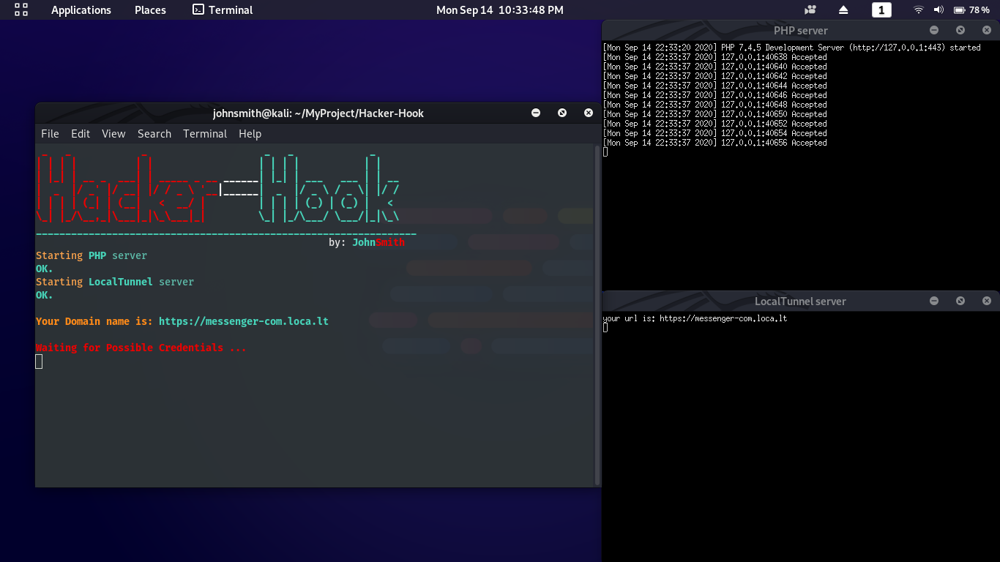

# Hacker-Hook
#### hacker-hook-phishing script tool created by [johnsmith](https://github.com/johnsmith80) on github advance phishing tool
#### advance phishing attack using NGROK. 36 available Phishing Page and running a server by a
#### localtunnel and ngrok!

## Pentester Alert:
#### Warning Do not user for illegal purposes. any illegal use of this tool is not my responsibility.
#### Use for Educational Purposes only. [Issue](https://github.com/johnsmith80/Hacker-Hook/issues) and [Pull request](https://github.com/johnsmith80/Hacker-Hook/pulls) Please Feel free to ask request add some site's. and checkout other [Releases](https://github.com/johnsmith80/Hacker-Hook/releases)

## Hacker-Hook Feature:
+ Advance 36 Phishing Pages
+ Hosted LocalTunnel, Ngrok
+ More Advance and Secured tunneling
+ Generate a best link for you
+ Easy, Fast & Convenient Phishing attack
+ Separated Cred's stored
+ Monitor for incoming Cred's
+ Added flavor for more realistic hacking


### Server:
+ NGROK click [here](https://ngrok.com/) download & install
+ LocalTunnel click [here](https://www.npmjs.com/package/localtunnel) download & install
## example:




## Usage:
```
  git clone https://github.com/johnsmith80/Hacker-Hook.git
  cd Hacker-Hook
  ./install.sh
  unzip webpage.zip
  sudo ./hackerhook.sh.sh
```
## Caution:
#### if localtunnel server give you an error like URL doesnt match. maybe the name doesn't allowed to use.
#### then use the url that LocalTunnel provide to you. will try to customize the link name.
#### dont use the same url all the time. thats make the localtunnel triggered to block your requested url-name
#### if ngrok failed or not compatible for your device. download it on there website: [NGROK](https://ngrok.com/)
#### mv on the DarkPhisher directory, unzip the file, then run the dependencies.sh again
```  
  ./install.sh
  sudo ./hackerhook.sh
```

Follow me:
+ [Facebook](https://web.facebook.com/h4ckitnow)
+ [Tiktok](https://www.tiktok.com/@johnsmith0911)
+ [Twitter](https://twitter.com/J0hnSm1th80)
+ [Youtube](https://www.youtube.com/channel/UCV5gF3dWxUOFoGA7P9NGviQ)
